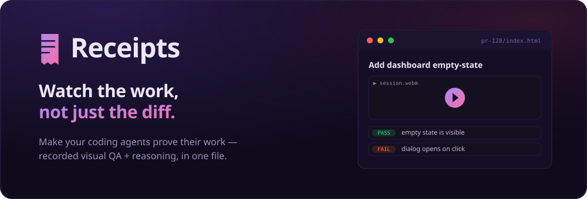
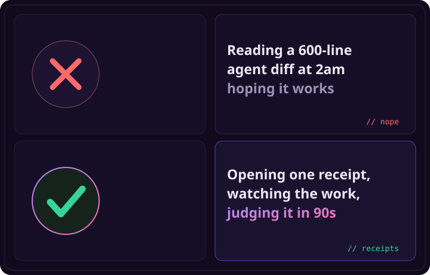
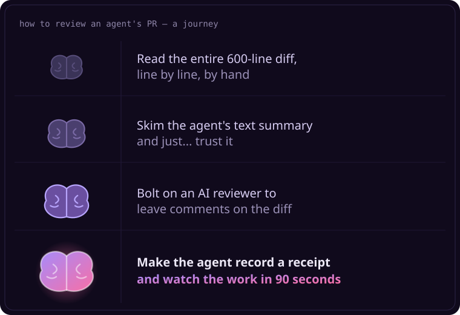

<div align="center">



<h1>🧾 Receipts</h1>

### Make your coding agents prove their work.

**Incumbents make AI _review the PR_. Receipts makes the agent _prove its work_ so a human can judge it.**
<br/>_"Review the thinking" → **"Watch the work."**_

<p>


</p>

<sub><a href="#-quickstart-5-minutes">Quickstart</a> · <a href="#-how-it-works">How it works</a> · <a href="#-whats-in-a-receipt">What's in a receipt</a> · <a href="#-receipts-vs-the-incumbents">vs. code reviewers</a> · <a href="#-cli">CLI</a> · <a href="#-as-a-claude-skill">Claude skill</a></sub>

</div>

---

A Claude skill **(and CLI)** that makes a coding agent leave **receipts**: a recorded visual-QA walkthrough **+** the reasoning behind every PR, packaged into **one self-contained file a human can judge in ~90 seconds.**

<div align="center">

<br/><sub>👆 the whole flow: <code>receipts qa</code> drives Playwright per claim, <code>receipts build</code> packages the receipt</sub>
</div>

A receipt is a folder you can open with **no server, no account, no hosting**:

```
.receipts/<id>/
├── index.html         ← open this (file://, no network)
├── manifest.json      ← single source of truth
├── receipt-input.json ← what was asked + how the agent reasoned
├── qa-results.json    ← per-claim verdicts
└── media/             ← session.webm, before/after screenshots, trace.zip
```

The report **leads with the video** (watch the work), then **expected-vs-actual** per acceptance claim, then **how the agent thought** (plan, decisions, rejected alternatives, prompt log), then the files changed.

---

## 🤔 The problem

Coding agents ship large PRs fast — often **5–20 in parallel**. The bottleneck moved from _writing_ code to _reviewing_ it. A reviewer opens an agent's PR and gets a diff and maybe a text summary: no view of how the agent reasoned, whether it QA'd the result, or how the working software actually looks. So review is either **slow** (rebuild the context by hand) or a **rubber stamp.**

<div align="center">

</div>

Existing tools either **review the code** (CodeRabbit, Qodo, Greptile, Bugbot), **show reasoning with no visual proof**, or **lock replay to one agent's platform.** Nobody packages recorded visual QA **+** reasoning **+** expected-vs-actual as a **tool-agnostic, self-hostable** artefact attached to the PR.

<div align="center">

</div>

---

## ⚡ Quickstart (5 minutes)

```bash
git clone https://github.com/fathyshalaby/nuro && cd nuro
npm install
npx playwright install chromium

# Run the bundled demo end-to-end (boots a tiny app, QAs 3 claims, builds the report):
npx receipts qa --input examples/receipt-input.json --no-judge
npx receipts build --in .receipts/demo-task-list
npx receipts open  --in .receipts/demo-task-list
```

That produces `.receipts/demo-task-list/index.html` — open it in any browser. Add `RECEIPTS_API_KEY` (Anthropic) and drop `--no-judge` to get **LLM-judged pass/fail verdicts** per claim.

### On your own project

Install the CLI (published as **`@fathyshalaby/receipts`** — the `receipts` name was taken on npm; the `receipts` command is unchanged):

```bash
npm i -g @fathyshalaby/receipts   # or prefix the steps below with: npx @fathyshalaby/receipts
npx playwright install chromium
```

1. Have your agent write a `receipt-input.json` ([schema](skills/receipts/references/schemas.md)) with the task, plan, decisions, and **falsifiable acceptance claims**.
2. `receipts qa --input receipt-input.json` (set `startCommand`/`targetUrl` in the input, or pass `--url`).
3. `receipts build --in .receipts/<id>` and open `index.html`.
4. _(optional)_ `receipts publish --in .receipts/<id>` to push it to Supabase and get a shareable link for the PR — see [Publish to Supabase](#-publish-to-supabase-optional).

---

## 🎬 How it works

```
agent finishes on a branch
        │
        ▼
[1] skill → agent writes receipt-input.json   (intent + reasoning, from session)
        │
        ▼
[2] receipts qa     → boots app, Playwright per claim, records video + trace,
        │              before/after screenshots, optional vision-LLM verdict
        ▼
[3] receipts build  → merges into manifest.json → renders self-contained index.html
        │
        ▼
[4] local: open it      ·      CI: upload artefact + comment on the PR
```

Three steps. **No hosting, no accounts, no telemetry.** It's a skill the agent runs itself — or three CLI commands you run by hand.

---

## ✨ What's in a receipt

| | Section | What it shows |
|---|---|---|
| 🎥 | **Watch the work** | The recorded Playwright session, embedded. Lead with the video — it's the hook. |
| 🟢🔴 | **Expected vs actual** | Per claim: before/after screenshots side by side, a pass/fail verdict, the model's rationale. |
| 🧠 | **How the agent thought** | Plan, key decisions, the alternatives it rejected and why, plus a collapsible prompt log. |
| 📁 | **Files changed** | Grouped by area, with additions/deletions — so the diff has context. |
| 📦 | **Self-contained** | Inline CSS/JS, media co-located, no CDN, no network. A file in your repo or a CI artefact. |
| 🚦 | **CI-gateable** | `receipts qa` exits non-zero on any failing claim. Backend-only PR? It degrades to reasoning-only. |

---

## 🆚 Receipts vs. the incumbents

|  | Code reviewers<br/><sub>CodeRabbit · Qodo · Greptile · Bugbot</sub> | Reasoning-only tools | Platform replay<br/><sub>Devin</sub> | **🧾 Receipts** |
|---|:---:|:---:|:---:|:---:|
| Recorded **visual QA** | ❌ | ❌ | ✅ | ✅ |
| **Reasoning** record | ❌ | ✅ | partial | ✅ |
| **Expected vs actual** | ❌ | ❌ | ❌ | ✅ |
| **Tool-agnostic** | ✅ | ✅ | ❌ | ✅ |
| **Self-hostable / no lock-in** | varies | varies | ❌ | ✅ |
| One artefact on the PR | ❌ | ❌ | ❌ | ✅ |
| Critiques your code | ✅ | ❌ | ❌ | **❌ (by design)** |

> Receipts **documents and demonstrates** — it doesn't critique the code. That's deliberate (see [Non-goals](#-non-goals-v0)). Run it _alongside_ your code reviewer.

---

## 🛠️ CLI

```
receipts qa      --input receipt-input.json [--url URL] [--start "CMD"] [--no-judge] [--out DIR]
receipts build   --in .receipts/<id>
receipts open    --in .receipts/<id>
receipts publish --in .receipts/<id> [--visibility unlisted|public] [--dry-run]
receipts login   --token <T> | --supabase-url <U> --supabase-key <K>   ·   logout · whoami
receipts tokens  issue|revoke|list                                    (operator — hosted mode)
```

- **`qa`** boots the app (if `startCommand` is set), drives Playwright per claim, records a video + trace, captures before/after screenshots, and — with an API key — asks a vision model for a verdict per claim. A claim with deterministic `steps` runs them as-is; a claim with only a plain-language `navigationHint` is reached by **LLM-driven navigation** (it plans Playwright steps from the hint).
- **Exit code:** `qa` exits **non-zero** if any claim **fails or is inconclusive**, so CI can gate. Reasoning-only and visual-only runs exit `0`.
- **`publish`** uploads the report + media to Supabase and writes `publish.json` with the hosted `reportUrl` + `videoUrl`. Optional — local receipts need nothing.
- **`login` / `tokens`** save publish credentials locally (`~/.receipts/config.json`, env always wins) and — for an operator — mint/revoke hosted upload tokens.

### Environment

| Var | Purpose |
|---|---|
| `RECEIPTS_API_KEY` | Anthropic API key for the vision judge. Omit → **visual-only** mode. |
| `RECEIPTS_MODEL` | Judge model id (default `claude-sonnet-4-6`). |
| `RECEIPTS_SUPABASE_URL` / `RECEIPTS_SUPABASE_KEY` | **Publish (BYO):** your own Supabase project URL + service-role key. |
| `RECEIPTS_TOKEN` / `RECEIPTS_INGEST_URL` | **Publish (hosted):** upload token + ingest endpoint for the shared instance. |

No telemetry. **The only network calls are the optional LLM judge and `receipts publish` (to the Supabase you point it at).**

---

## 🤖 As a Claude plugin

Receipts ships as a **Claude Code plugin** ([`.claude-plugin/`](.claude-plugin/)) that bundles the `receipts` skill ([`skills/receipts/SKILL.md`](skills/receipts/SKILL.md)). Install it from this repo's marketplace:

```
/plugin marketplace add fathyshalaby/nuro
/plugin install receipts
```

Once installed, it triggers on prompts like _"QA this and leave receipts on the PR"_ and runs the full flow itself: write `receipt-input.json` from session → `receipts qa` → `receipts build` → _(optional)_ `receipts publish` → surface the link. The skill is also usable standalone (drop [`skills/receipts/`](skills/receipts/) into `.claude/skills/`).

## 🗄️ Publish to Supabase (optional)

A receipt is a **local, self-contained folder by default — no hosting needed.** `receipts publish` is the optional step that puts it behind a URL so a PR comment can link to **the hosted report** _and_ **the raw video**. Two modes, picked from the environment:

- **Bring your own** — set `RECEIPTS_SUPABASE_URL` + `RECEIPTS_SUPABASE_KEY` (service role) and publish straight to your own project.
- **Hosted ("ours")** — set `RECEIPTS_TOKEN`; the CLI POSTs an ingest endpoint that holds the service key, so end users never do.

Both write to the same schema (`manifest.json` stays the source of truth). Apply [`supabase/migrations/0001_receipts.sql`](supabase/migrations/0001_receipts.sql) (tables, RLS, storage bucket); the hosted path also deploys [`supabase/functions/ingest`](supabase/functions/ingest/). **Full setup, the ingest protocol, and access-control notes are in [`docs/hosting.md`](docs/hosting.md).**

### Gallery

[`web/`](web/) is a Next.js app — the hosted "multiplayer review" surface. Sign in (Supabase magic-link), browse your published receipts, filter by repo/verdict, and open a detail view that embeds the report and links the video. It only ever **reads** the `receipts` table (RLS-scoped); `cd web && npm install && npm run dev`.

## 🚀 GitHub Action

[`.github/workflows/receipts.yml`](.github/workflows/receipts.yml) is a template: on a PR it installs Playwright, runs `qa` + `build`, **publishes to Supabase when configured**, uploads the receipt folder as an artefact, and posts/updates a PR comment linking to the **hosted report + raw video** (falling back to the artefact when no Supabase target is set). Copy it and adapt the boot step for your stack.

## 🌐 Landing page

A static marketing site lives in [`site/`](site/) — one self-contained `index.html` + `styles.css`, no build step. Open it locally, or deploy to GitHub Pages with [`.github/workflows/pages.yml`](.github/workflows/pages.yml).

---

## 🪂 Graceful degradation

- **Backend / API-only PR** (no acceptance criteria or no `targetUrl`): emits a **reasoning-only** receipt, exits 0, and the report header says no visual QA ran. Never hard-fails because there was nothing visual to test.
- **No API key:** **visual-only** receipt (video + screenshots, verdicts `not_tested`). Still valid and useful.

## 🚫 Non-goals (v0)

- **Not an AI code reviewer.** No review comments, no severity ratings on the diff. We document and demonstrate; we don't critique the code.
- **Not observability/metrics.** No token/cost/latency dashboards.
- **Not a test-framework replacement.** We orchestrate Playwright; we don't reinvent assertions or visual-diff baselines.
- **Hosting is optional, not required.** The local self-contained folder is the default and always works offline. `receipts publish` (Supabase, BYO or hosted) is an opt-in add-on for a shareable PR link — `manifest.json` stays the single source of truth so the same artefact powers both. _(Hosted multiplayer review is still Phase 2.)_
- **UI/frontend work is the target.** API-only PRs degrade gracefully.

## 🧭 Design decisions

- **Wrap Playwright directly** (don't depend on `yutori-ai/frontend-visualqa`), borrowing its claim/verdict discipline — small dependency surface, the artefact is fully ours. Claims are natural language, judged by a vision LLM from screenshots (deterministic pixel asserts are out — too brittle).
- **Visual-only is a first-class mode**, so anyone without an API key still gets a useful receipt.
- **Receipts are gitignored by default** (CI artefact is the canonical delivery); `git add -f .receipts/<id>` to put one in the PR diff.

## 🧱 Tech

TypeScript / Node, Playwright (`recordVideo` + `context.tracing`, pinned Chromium), self-contained HTML (inline CSS/JS, no CDN, no `localStorage`). Runs via `tsx` — **no build step.**

## 📄 License

[MIT](LICENSE). Go wild.

<div align="center"><br/><sub>Generated by Receipts — <b>watch the work.</b></sub></div>
